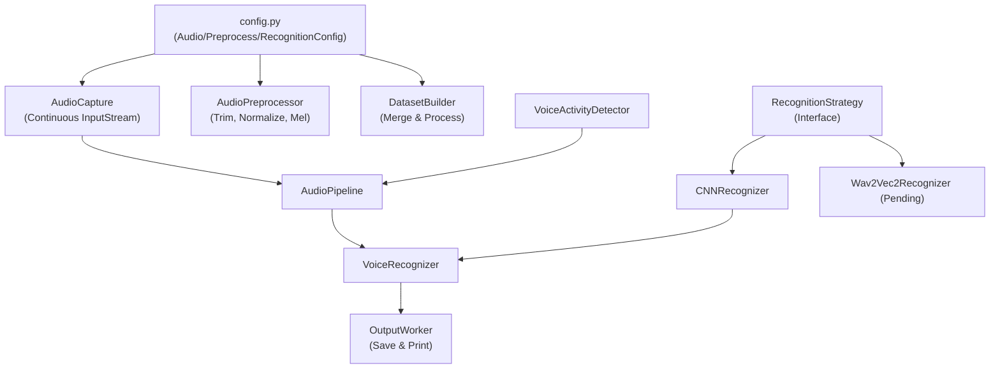

# Voice Recognizer リファクタリング成果 & 今後の開発ロードマップ

## 概要

本ドキュメントは、`voicerecognizer` リポジトリにおける**これまでのリファクタリング成果**と、**今後の開発およびアーキテクチャ変更計画（ロードマップ）** をまとめたものです。

---

## 1. リファクタリング成果まとめ

### 1.1 定数・ハイパーパラメータの一元管理 (`config.py`)
従来各ファイル（認識器、データセットローダー、前処理、スクリプト）に散在していた数値リテラルやパスを [`config.py`](file:///c:/Users/yamadarikuto/Mycode/voicerecognizer/config.py) の Dataclass に集約しました。

| 設定クラス | 管理対象 | 主な設定値 |
|---|---|---|
| `AudioConfig` | 音声入力・サンプリング設定 | `sample_rate`: 16000Hz, `chunk_seconds`: 0.1s, `window_seconds`: 1.0s, `channels`: 1 |
| `PreprocessConfig` | 前処理・VAD・メル変換設定 | `n_mels`: 64, `n_fft`: 400, `hop_length`: 160, `top_db`: 30.0, `vad_silence_threshold`: 0.005 |
| `RecognitionConfig` | モデル・ラベル・ディレクトリパス設定 | `labels`: ("a", "e", "i", "o", "u"), `raw_dataset_dir`, `merged_dataset_dir`, `processed_dataset_dir` |

### 1.2 マイク入力の常時ストリーミング化 (`AudioCapture`)
録音ごとのマイクオープン/クローズ処理に伴うウォームアップ遅延や音量ゼロ問題を解決するため、[`AudioCapture`](file:///c:/Users/yamadarikuto/Mycode/voicerecognizer/runtime/audio_capture.py) をバックグラウンド常時ストリーミング方式へ刷新しました。
- `sounddevice.InputStream` の非同期コールバックでリングバッファ (`collections.deque`) に常時記録。
- `capture_once()` は最新のウィンドウサンプル（1.0秒分）を即座に安全抽出（`threading.Lock` 保護）。

### 1.3 ノイズ環境適応型 VAD (`threshold_calculator`)
環境ノイズの変化に対応できるよう Strategy パターンを導入し、動的閾値計算ロジックを構成しました。
- `AbstractSilenceThresholdCalculator`（抽象基底クラス）
- `FixedSilenceThresholdCalculator`（固定閾値モード）
- `AdaptiveSilenceThresholdCalculator`（バックグラウンドノイズ移動平均追跡モード）

### 1.4 スクリプト・コードベースの整理
- 2.5MB の不要な静的ダンプファイル (`directory_tree.txt`) や旧サンプルコード (`REFACTORING_EXAMPLES.py`)、重複していた `core/dataset.py` や `preprocessing/collect.py` を削除。
- `script/preprocess.py` および `script/merge_data.py` の重複処理を [`DatasetBuilder`](file:///c:/Users/yamadarikuto/Mycode/voicerecognizer/preprocessing/dataset_builder.py) のメソッド呼出へ一本化。

### 1.5 隔離型単体テスト環境の構築
- [`tests/test_dataset_builder.py`](file:///c:/Users/yamadarikuto/Mycode/voicerecognizer/tests/test_dataset_builder.py) にて `tempfile.TemporaryDirectory()` を使用するテストを実装。
- テスト実行時にリポジトリ上の本番データセット (`processed_dataset/` や `merged_dataset/`) を一切汚染・上書きしない安全なテスト体系を確立しました。

---

## 📐 2. 現在のコンポーネント構成図

---

## 🚀 3. 今後の変更計画ロードマップ

### 📍 Phase 1: Python標準ログ (`logging`) 導入と定量評価用メトリクス基盤の整頓
- **背景**: 現状の `print()` 文による標準出力を整理し、音声入力から推論結果出力までの各処理フェーズにおける所要時間・レイテンシを定量的に計測・評価できるようにする。将来的な OpenTelemetry 導入を見据え、まずは拡張しやすい標準 `logging` 構成へ刷新する。
- **実施タスク**:
  1. **標準 `logging` システムへの移行**:
     - `AudioPipeline`, `AudioCapture`, `OutputWorker`, `CNNRecognizer` 等に分散している `print()` 文を `logging.getLogger(__name__)` に置き換え。
     - ログフォーマット（タイムスタンプ、ログレベル、モジュール名、メッセージ）の統一管理。
  2. **処理時間・レイテンシの定量計測 (Metrics Logging)**:
     - 録音取得、VAD 判定、前処理（ノイズ除去/長さ統一）、メル変換、推論実行の各処理ブロックの所要時間 (ms) をログに記録。
     - ログフォーマットを将来の OpenTelemetry / トレーシング拡張（トレースIDやスパン情報）に対応可能な構造に設計。

### 📍 Phase 2: Wav2Vec2 Recognizer の本格実装
- **背景**: 現行の CNN モデル（一文字判定）では、リアルタイム性と文脈依存の判定精度に課題があるため、事前学習済み Wav2Vec2 モデルへの移行を予定。
- **実施タスク**:
  1. [`recognizers/wav2vec2_recognizer.py`](file:///c:/Users/yamadarikuto/Mycode/voicerecognizer/recognizers/wav2vec2_recognizer.py) の具象クラス実装（ファインチューニング済みウェイトのロード、推論処理）。
  2. 高速推論用 ONNX / TorchScript へのモデルエクスポートスクリプトの整備 (`models/wav2vec2/export.py`)。
  3. CNN と Wav2Vec2 の精度・推論レイテンシ比較ベンチマークの自動化（Phase 1 で構築したメトリクスログを活用）。

### 📍 Phase 3: 非同期・並列ストリーミングパイプラインの拡張
- **背景**: 音声入力、VAD判定、モデル推論、点字出力のパイプラインを完全ノンブロッキング化し、リアルタイム応答性を極限まで高める。
- **実施タスク**:
  1. `runtime/queues.py` および `runtime/inference_worker.py` を活用した、マルチスレッド/非同期キュー処理の本格導入。
  2. バックグラウンド音声ストリームからの常時 VAD 判定と連続発話切り出し。

### 📍 Phase 4: Braille Coach Ring（本体システム）との統合
- **背景**: 本リポジトリで開発した音声認識エンジンを `braille-coach-ring` メインアプリケーションへ組み込み、点字学習フィードバックシステムを完成させる。
- **実施タスク**:
  1. `voicerecognizer` パッケージのモジュールAPI整理（Python package インストール対応）。
  2. `braille-coach-ring` からの音声認識サービス呼出インターフェースの接続。
